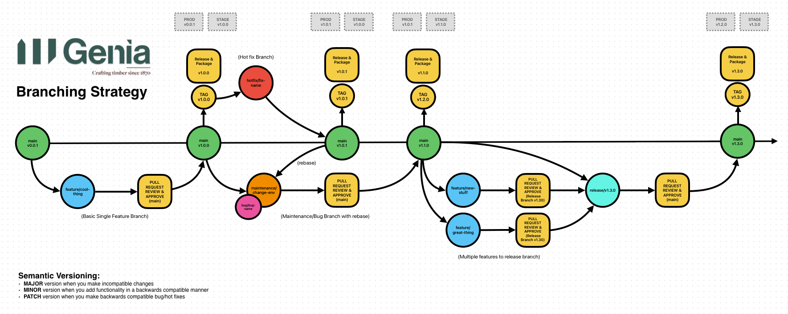

# Git Branching Guide

> Each team will have it's own branching strategy, hopefully. This is a general guide to help you understand the concepts.

## Types of Git Branches:

1. **Regular Branches**:

   - **Development (Dev)**: Primary development branch. It undergoes reviews and tests before merging to the master.
   - **Main**: Production branch, stable branch. Direct check-ins aren't usually allowed.
   - **QA/Test**: Contains QA codes and automation testing.

2. **Temporary Branches**:
   - Bug Fix, Hot Fix, Feature Branches.

## Git Branch Naming Best Practices:

1. **Start with a Category Word**:
   - `fix-' or `feature-`
2. **Include Issue Tracker IDs**:

   - `fix-issue#123-`.

3. **Use Hyphen or Slash Separators**:

   - `feature/login-module`.

4. **Include Author's Name (optional)**:

   - `feature-fuzzy-search-phillip`.

5. **Avoid Numerals Only**:

   - not just `123`, but `bug-123`.

6. **Maintain Consistency**:

   - Stick to one naming convention across the team. Most teams will have one before you arrive.

7. **Keep Names Short & Informative**:
   - E.g., use `feature_public_login` instead of `feature_login_module_for_public_website`.

## Genia Branching Strategy

